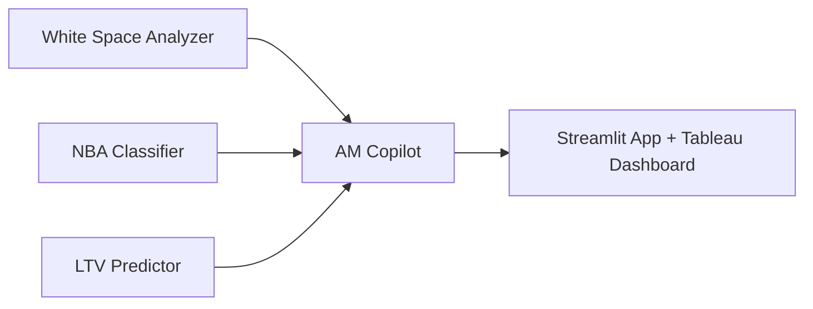

# Hi, I'm Thais Paulino

Data-focused professional with a background in enterprise B2B Sales & Account Management, now working as a Data Analyst at Sinch (Stockholm).
I work with Python, SQL, pandas, and data storytelling to transform raw data into clear business insights that support decisions in marketing, product, and commercial strategy.

---

## 🔍 What I'm Working On

As a Data Analyst at **Sinch** (Stockholm), I focus on **GTM, RevOps, and Commercial Analytics** — turning portfolio and pipeline data into actionable intelligence for Account Management and go-to-market teams.
Outside of work, I'm deepening my ML and LLM skills through end-to-end projects that bridge commercial intuition with data science.

---

## 🛠️ Technical Skills

**Languages & Tools:**
- Python (pandas, NumPy, matplotlib, seaborn)
- SQL
- Jupyter Notebook
- Streamlit
- Git/GitHub
- Basic statistical analysis & hypothesis testing

**Areas of Interest:**
Customer analytics, product analytics, revenue insights, fintech strategy, churn & retention, marketing optimization, forecasting.

---

## 📌 Featured Projects

### 🚀 B2B Revenue Intelligence Platform

> An end-to-end commercial analytics capstone that transforms enterprise CPaaS portfolio data into concrete AM actions — replacing gut-feel prioritization with ML-driven upsell recommendations, LTV forecasts, and an AI-powered account copilot.

<!-- TODO: add screenshot -->

**4 integrated modules:**

- **White Space Analyzer** — Association rules + collaborative filtering to surface ranked product recommendations per account, based on peer adoption patterns.
- **Next Best Action (NBA) Classifier** — Multi-class classifier (Upsell / Expand / Retain / Nurture) with SHAP explanations, so AMs know *why* each action is recommended.
- **LTV Predictor** — LightGBM regression model estimating 12-month forward revenue per account, enabling priority-ranked outreach.
- **AM Copilot** — LLM-powered Streamlit chat interface (Claude API / GPT-4o) that synthesizes all three model outputs into plain-language account narratives — no SQL required.

**Links:**
- 🔗 [GitHub Repo](https://github.com/thaispaulino/b2b-revenue-intelligence)
- 📊 Tableau Public dashboard — *coming soon*
- ⚡ Live Streamlit app — *coming soon*

---

### Other Projects

| Project | Description |
|---|---|
| [Vehicle Data Explorer](https://github.com/thaispaulino/Project---Sprint-5) | Interactive Streamlit app to explore and visualize vehicle data — filtering, cleaning, and visual insights. |
| [Telecom Customer Behavior Analysis](https://github.com/thaispaulino/telecom-customer-behavior) | Business-focused analysis comparing two prepaid plans to understand profitability and guide marketing investment. |
| [User Behavior Analysis](https://github.com/thaispaulino/User-Behavior-Analysis-with-Python-Pandas) | Explores usage patterns by weekdays and cities to help optimize marketing and operations. |
| [Video Game Sales Analysis](https://github.com/thaispaulino/Video-Game-Sales-Analysis-Predicting-Success-Factors) | Identifies success factors in game performance across regions, platforms, and genres. |

---

## 📫 Connect With Me

- LinkedIn: https://www.linkedin.com/in/thais-paulino-9942a260/
- GitHub: github.com/thaispaulino

If you'd like to discuss data projects, product analytics, or fintech strategy, feel free to reach out.
